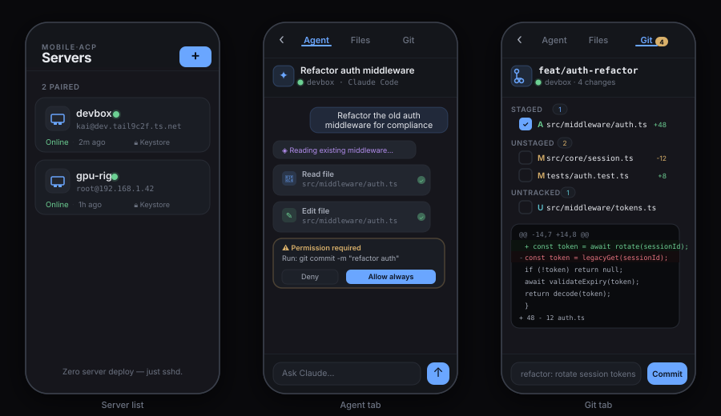
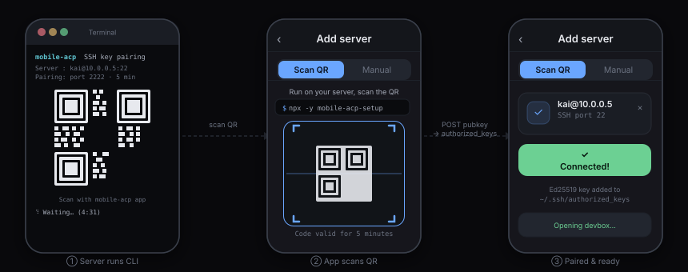

# mobile-acp

**SSH Zed for Android.** Connect to any server over SSH and run coding agents (Claude Code, Codex, Gemini CLI) from your phone — no app installed on the server, just sshd.

<p align="center">
  
</p>

---

## What it does

- **Pair a server in 30 seconds** — run one command on the server, scan the QR code, done. An Ed25519 key is generated on the device and added to `~/.ssh/authorized_keys` automatically.
- **Run coding agents** — spawn Claude Code (or any ACP-compatible agent) over SSH. Full streaming output: thoughts, tool calls, permission prompts, plan updates.
- **Browse files & Git** — real directory tree and `git status`/`diff`/`commit` over the same SSH connection, no extra daemons.
- **Zero server deploy** — the server needs nothing beyond `sshd` and whatever agent you want to run (`npx`, `claude`, etc.).

## Architecture

```
┌──────────────────── Android App ────────────────────────┐
│  HomeScreen (server list + QR pairing)                  │
│  MainShell                                              │
│   AgentTab ──── LiveSession ──── AgentClient ───────┐   │
│   GitTab   ──── exec()      ──── SshTransport ─────►│   │
│   FilesTab ──── exec()      ──────────────────────  │   │
│                                                      │   │
│  SshTransport (Kotlin/JSch native module)            │   │
└──────────────────────────────────────────────────────┘   │
                 │ SSH (Ed25519, Android Keystore)          │
┌────────────────▼──────────── Server ────────────────┐    │
│  sshd (only requirement)                            │    │
│  agent: npx @agentclientprotocol/claude-agent-acp   │    │
│  git, ls, cat (for Git/Files tabs)                  │    │
└─────────────────────────────────────────────────────┘
```

**Protocol**: [Agent Client Protocol (ACP)](https://agentclientprotocol.com) — JSON-RPC over stdio, spawned via SSH.

## Pairing a server

On the server (needs Node ≥ 18):

```sh
npx -y mobile-acp-setup
```

This prints a QR code in the terminal. Open the app → **Add Server → Scan QR**. The app generates an Ed25519 keypair, POSTs the public key to a 5-minute local HTTP server, and tests the SSH connection — all in one tap.

<p align="center">
  
</p>

## Status

| Component | Status |
|---|---|
| SSH transport (JSch native module) | ✅ |
| Ed25519 key generation (Android Keystore) | ✅ |
| QR pairing flow (camera + server CLI) | ✅ |
| ACP agent session (streaming, tools, permissions) | ✅ |
| Git tab (status, diff, commit) | ✅ |
| Files tab (tree, lazy dirs, cat preview) | ✅ |
| Server list persistence (AsyncStorage) | ✅ |
| SSH native transport (prod) | ✅ |
| WebSocket bridge (dev / Expo Go) | ✅ |
| GitTab / FilesTab real exec() | ✅ |
| GitHub Actions APK build | ✅ |
| SSH key import (manual flow) | ✅ |
| Native SSH transport on iOS | ❌ not started |
| Session resume / thread list | ❌ not started |

## Building

### APK via GitHub Actions (recommended)

Every push to `main` triggers a build. Download the APK from **Actions → Build APK → Artifacts**.

To cut a release:
```sh
git tag v0.x.0 && git push origin v0.x.0
```
The APK appears as a GitHub Release asset.

### Local (needs Android SDK + JDK 17)

```sh
npm install
npx expo run:android
```

## Development

```sh
npm install
node bridge/server.mjs          # start dev WebSocket bridge on :8790
npx expo start --web            # or Expo Go
```

The dev bridge lets the web/Expo Go client talk to a real agent running locally without native SSH.

## Tech

- **React Native 0.76** / Expo 52
- **ACP SDK** `@agentclientprotocol/sdk` — JSON-RPC agent protocol
- **JSch** via a custom Expo Module (Kotlin) for SSH
- **expo-camera** for QR scanning
- **expo-secure-store** / Android Keystore for private key storage

## Repo layout

```
src/
  core/          Transport, LiveSession, AgentClient, SessionStore, servers
  screens/       HomeScreen (server list + pairing), MainShell, ServerDetail
  tabs/          AgentTab, LiveAgentTab, GitTab, FilesTab
  components/    Icon, CodeBlock, Primitives (Press, Btn, Sheet, …)
modules/
  ssh-transport/ Expo Module — Kotlin/JSch SSH native implementation
bridge/          Dev WebSocket bridge (Node.js)
server/          Server-side pairing CLI (npx mobile-acp-setup)
android/         Native Android project
docs/            SVG diagrams
```
